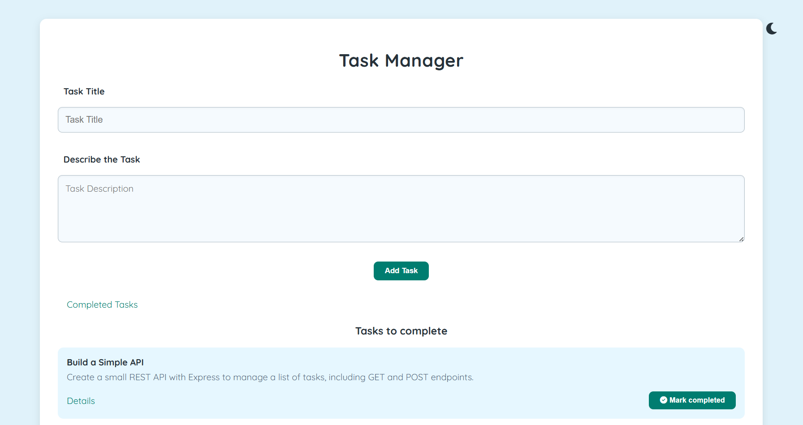

# 📝 Task Manager

A simple yet powerful full-stack task management app built using **Node.js**, **Express**, and **EJS**. Whether you’re organizing your daily to-dos or keeping track of long-term projects, this app lets you create, edit, delete, and manage your tasks easily — all with a clean, responsive design and theme toggle!

---

##  What You Can Do

-  Add new tasks
-  Edit existing tasks
-  Delete tasks you no longer need
-  Mark tasks as completed (and move them back if needed)
-  View task details on a dedicated page
-  Your tasks are stored persistently in a `JSON` file — no database setup required
-  Switch between dark and light mode with a single click
-  Sleek UI with **Font Awesome** icons

---

##  Built With

- **JavaScript (ES6+)**
- **Node.js**
- **Express.js**
- **EJS** templating engine
- **HTML / CSS**
- **Font Awesome**
- **JSON** for simple data storage

---

##  Project Folder Structure

```
Task-Manager/
├── views/            # EJS templates
│   ├── home.ejs
│   ├── completed.ejs
│   ├── details.ejs
│   └── edit.ejs
├── public/           # Static CSS files
│   └── style.css
├── data.json         # Stores your tasks
├── index.js          # Main server file
└── package.json      # Project metadata and dependencies
```

---

##  How to Run It Locally

1. **Clone the repository**

```bash
git clone https://github.com/nagakumar-yanamadala/Task-Manager.git
```

2. **Install all required packages**

```bash
npm install
```

3. **Start the server**

```bash
node index.js
```

4. **Open your browser**

Visit: [http://localhost:3000](http://localhost:3000)

---

##  Preview



---

##  What’s Coming Next

-  User authentication
-  Switch from JSON to MongoDB for better scalability
-  Drag-and-drop task sorting
-  Accessibility improvements for keyboard and screen readers

---

##  License

This project is licensed under the **MIT License** — feel free to use, modify, and share!
